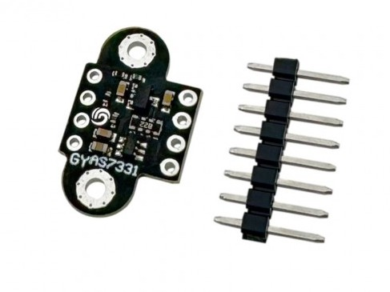
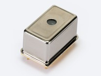
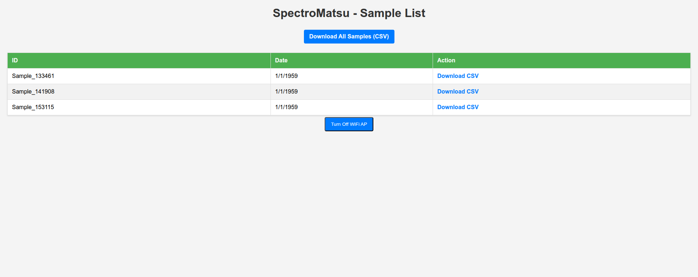
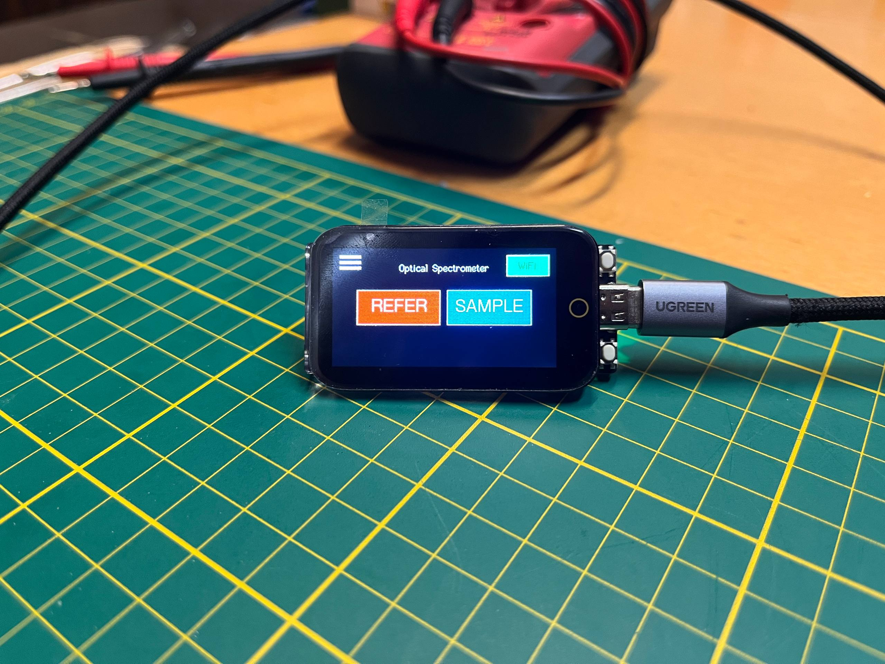
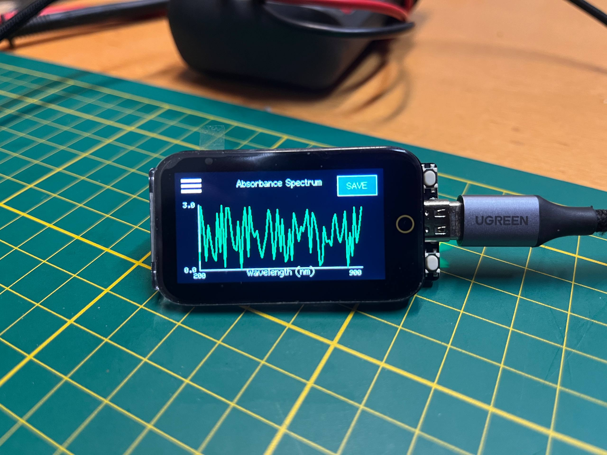
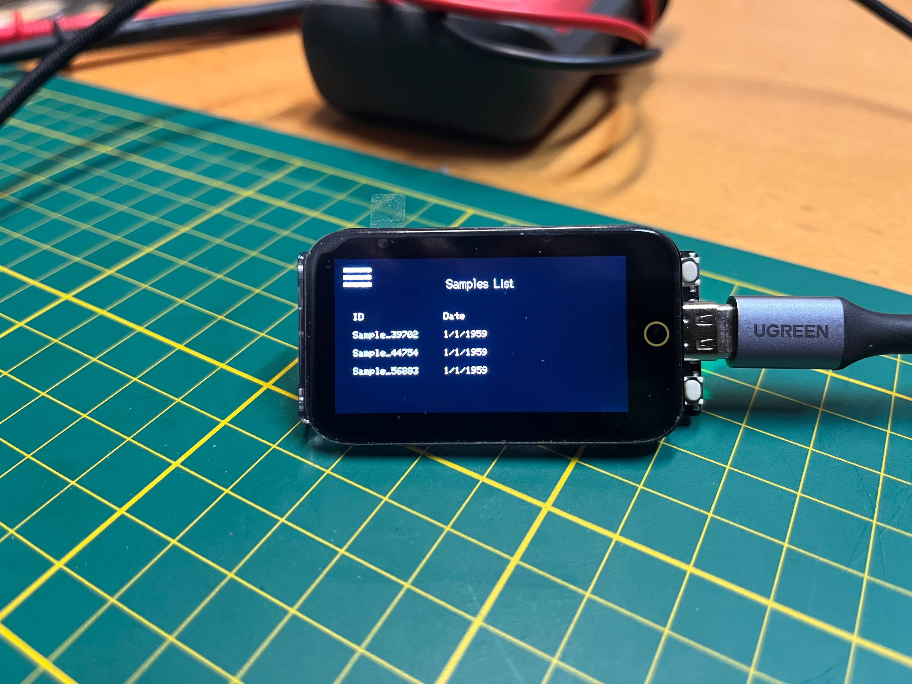
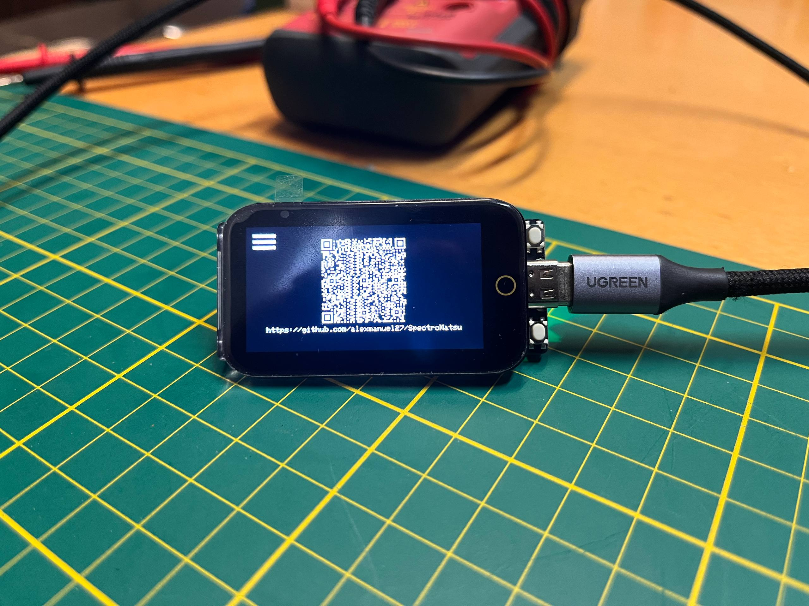

# SpectroMatsu

A lightweight, portable, open-source spectrophotometer designed for in-situ water quality and other compound analysis. Built with the Hamamatsu C12880MA miniature spectrometer sensor and the 3-channel ultraviolet AS7331 light sensor.

## Table of Contents

- [Features](#features)
- [Hardware](#hardware)
  - [Sensor](#sensor)
  - [Microcontroller & Display](#microcontroller--display)
  - [Hardware Design (PCB)](#hardware-design-pcb)
- [Software](#software)
- [Installation](#installation)
- [Usage](#usage)
- [License](#license)

## Features

*   **Portable & Low-Cost:** Designed for field use with a focus on affordability.
*   **Open Source:** Hardware schematics and software are freely available.
*   **Real-Time Data:** Captures and displays absorbance spectra.
*   **Local Data Storage:** Saves measurement samples to an external EEPROM.
*   **WiFi Connectivity:** Enables a local web interface for data access and control.
*   **Intuitive Touch Interface:** Easy-to-use graphical menu system on a 1.9" color display.
*   **Sample Management:** Functions to take, save, list, and download sample data (individually or in bulk) via the local web interface.

## Hardware

### Sensor

*   **Model:** 
    *   Hamamatsu C12666MA
    *   AS7331
*   **Type:** Combined miniature linear image sensor for spectral analysis and optical filters with the AS7331 sensor to achieve a broader spectral range.
*   **Spectral Range:** A combination of visible and ultraviolet light, suitable for detecting various water quality indicators through absorbance measurements.
*   **Integration:** Interfaces directly with the custom-designed PCB for signal conditioning and data acquisition.

### Microcontroller & Display

*   **Microcontroller:** ESP32-S3 (specifically, the LilyGo T-Display-S3 module).
*   **Features:** WiFi capability, sufficient processing power for basic spectroscopic calculations.
*   **Display:** 1.9" 320x170 pixel color TFT LCD with capacitive touch panel.
*   **Purpose:** Provides the user interface for control, data visualization (spectra), and menu navigation.

### Hardware Design (PCB)

*   **Status:** Custom-designed PCB specifically for integrating the Hamamatsu C12666MA sensor with the LilyGo T-Display-S3.

*   **Functionality:**
    *   Includes the necessary components for sensor biasing, timing, and signal conditioning (e.g., amplification, filtering).
    *   Interfaces with the LilyGo T-Display-S3's GPIO pins for data acquisition and control.
    *   Provides stable mechanical mounting for the sensor relative to the optical path.

## Software

*   **Platform:** PlatformIO.
*   **Core Functionality:**
    *   Processes raw sensor data to generate absorbance spectra.
    *   Provides a graphical user interface (GUI) on the TFT display using a state machine architecture.
    *   Handles touch input for navigation and control.
    *   Stores measurement data (samples) on an external EEPROM of the ESP32.
    *   Manages WiFi access point (AP) mode.
    *   Runs a local web server providing a web interface for sample listing and downloading (CSV format).
    *   Implements a simple menu system accessible via the touchscreen.

### Key Functionalities

#### Sample Taking:

*   Navigate to the main screen.
*   Press the "REFER" button.
    *   The system saves the blank/reference value for later absorbance calculation.
*   Press the "SAMPLE" button.
    *   The system enters an acquisition and absorbance calculation phase.
*   After acquisition, the resulting spectrum is displayed.
*   Press the "SAVE" button to store the spectrum in the EEPROM with a generated name.

#### Sample Listing:

*   Access the main menu (hamburger icon).
*   Select "SAMPLES".
*   A list of saved sample names and dates (default date shown) is displayed on the screen.

#### Local Web Interface:

*   Activate the WiFi AP by pressing the WiFi button on the main screen.
*   Connect your mobile device or computer to the `SpectroMatsu` WiFi network.
*   Open a web browser and navigate to the AP's IP address (typically `192.168.4.1`).
*   View the list of saved samples.
*   Download individual sample data as CSV files.
*   Download all stored samples as a single CSV file.
*   Turn off the WiFi AP from the web interface.

#### Settings & Info:

*   Access system information (firmware version, device model, WiFi status, sample count) via the "SETTINGS" menu.
*   Use the "ABOUT" menu to view a QR code linking to this repository.

## Installation

1.  Clone or download this repository.
2.  Install [PlatformIO](https://platformio.org/) in your preferred IDE (VSCode recommended).
3.  Open the project folder in PlatformIO.
4.  Ensure your LilyGo T-Display-S3 is connected to your computer via USB.
5.  Build and upload the firmware using PlatformIO's upload command (`Ctrl+Alt+U` in VSCode).

## Usage

1.  Power on the device.
2.  Use the touch screen to navigate menus and take samples.
3.  Activate WiFi via the main screen button to access the web interface.
4.  Connect to the `SpectroMatsu` WiFi network and use a web browser to manage samples.

## License

This project is licensed under the MIT License.